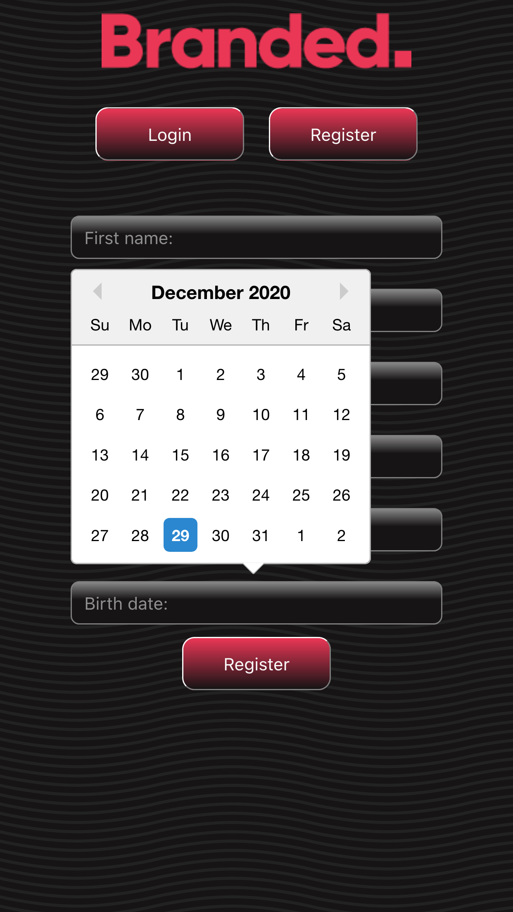
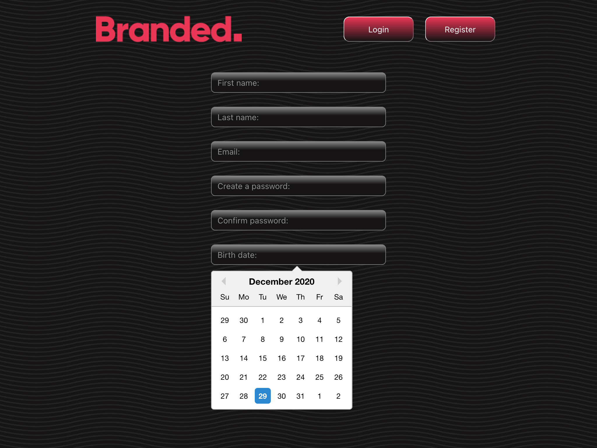
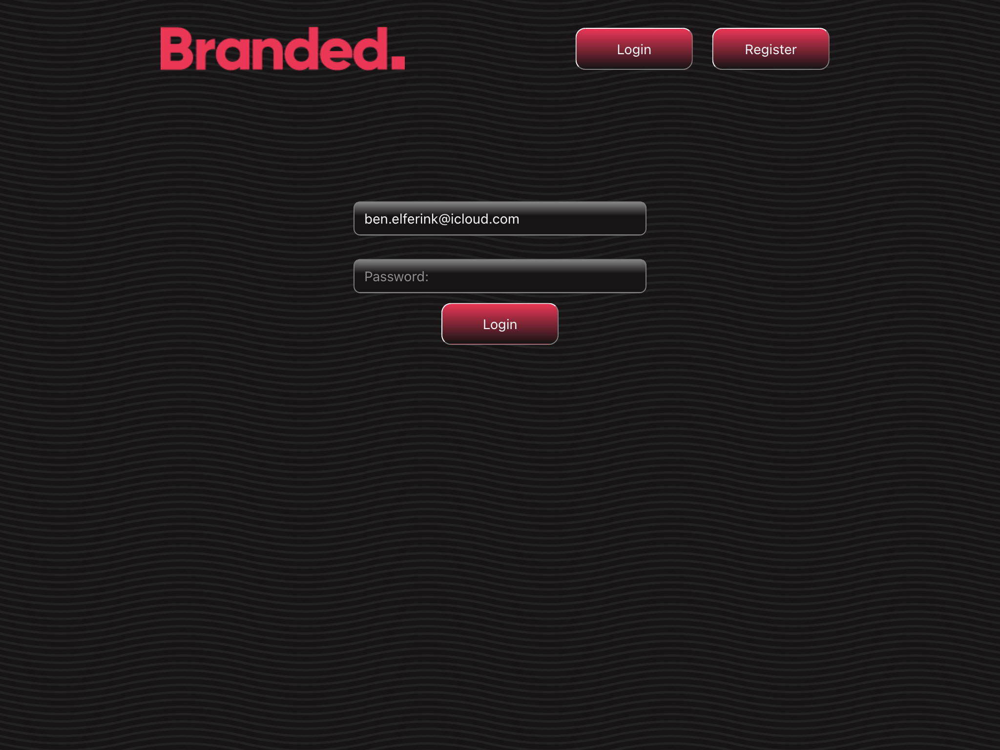
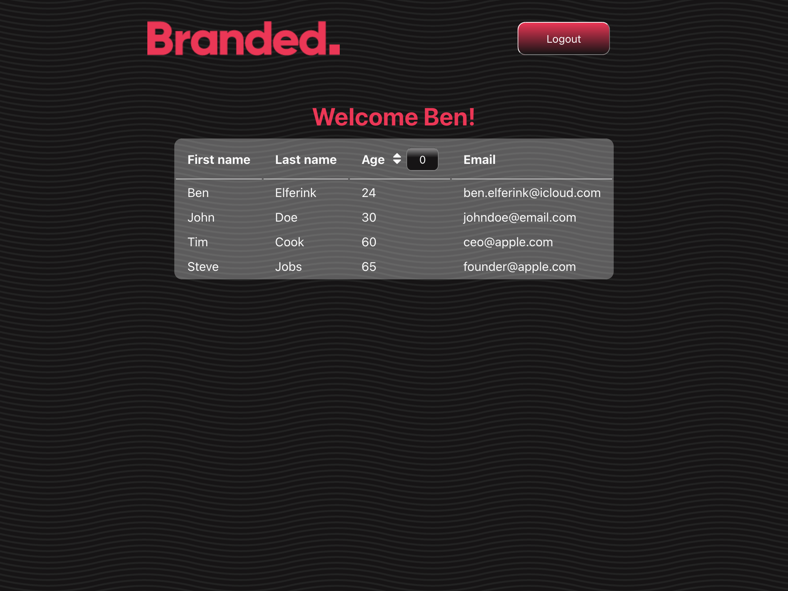

# Frontend

This project was bootstrapped with [Create React App](https://github.com/facebook/create-react-app).

## Preview of UI:

### Home page:

 

### Register page:

 

### Login page:

 

### Database content:

 

